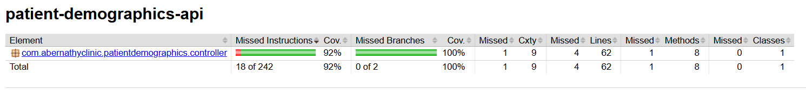

# Patient Demographics Management API at Abernathy Clinic

## 1. Project Description

This is a Spring Boot REST API designed for managing patient demographics at Abernathy Clinic. It provides endpoints to:

- Retrieve a list of all patients.
- Retrieve a specific patient by their ID.
- Update an existing patient's information.
- Add a new patient to the system.
- Delete a patient by their ID.

The API is built using Spring Boot and utilizes a PostgreSQL database for persistent storage.

**Controller:** `PatientController.java` located in the project's controller package.
**Model Classes:**
- `Patient.java`: Represents the patient entity with fields for given name, family name, date of birth, sex, home address, and phone number. It includes unique constraints on the date of birth and the combination of given and family names.
- `PatientList.java`: A wrapper class containing a list of `Patient` objects.

## 2. Docker Deployment

This project can be easily deployed using Docker. Ensure you have Docker and Docker Compose installed on your system.

**Steps:**

1.  **Package the application:** Navigate to the root directory of the project in your terminal and run the following Maven command to build the application:
    ```bash
    mvn clean package
    ```
    This will create an executable JAR file in the `target` directory.

2.  **Run Docker Compose:** From the root directory of the project (where the `docker-compose.yaml` file is located), run the following command:
    ```bash
    docker-compose up -d
    ```
    This command will build the Docker image (if it doesn't exist) and start the application and the PostgreSQL database in separate containers.

**`docker-compose.yaml`:**
```yaml
services:
  app:
    image: 'docker-spring-boot-postgres:latest'
    build:
      context: .
    ports:
      - "8081:8081"
    container_name: app
    depends_on:
      - db
    environment:
      - SPRING_DATASOURCE_URL=jdbc:postgresql://db:5432/compose-postgres
      - SPRING_DATASOURCE_USERNAME=compose-postgres
      - SPRING_DATASOURCE_PASSWORD=compose-postgres
      - SPRING_JPA_HIBERNATE_DDL_AUTO=update

  db:
    image: 'postgres:13.1-alpine'
    ports:
      - "15432:5432"
    container_name: db
    environment:
      - POSTGRES_USER=compose-postgres
      - POSTGRES_PASSWORD=compose-postgres

networks:
  patient-services-network:
    name: patient-services-network

```
The application will be accessible at http://localhost:8081. The PostgreSQL database will be accessible on port 15432 on your local machine.


## 3. Adding Test Data

You can add test patient data to the database by sending GET requests to the `/patient/add` endpoint with the following parameters: `family`, `given`, `dob` (date of birth in `YYYY-MM-DD` format), `sex`, `address`, and `phone`.

Here are some example requests (you can use tools like Postman or curl):

- `GET /patient/add?family=Doe&given=John&dob=1990-05-15&sex=Male&address=123 Main St&phone=555-1234`
- `GET /patient/add?family=Smith&given=Jane&dob=1988-11-20&sex=Female&address=456 Oak Ave&phone=555-5678`

## 4. JaCoCo Report

The JaCoCo code coverage report for this project can be found within the project structure at:


This report provides details on the test coverage of the codebase.

## 5. Minimum Java Version

This project requires **Java 21** or a later version to run. Please ensure that your Java environment meets this minimum requirement.